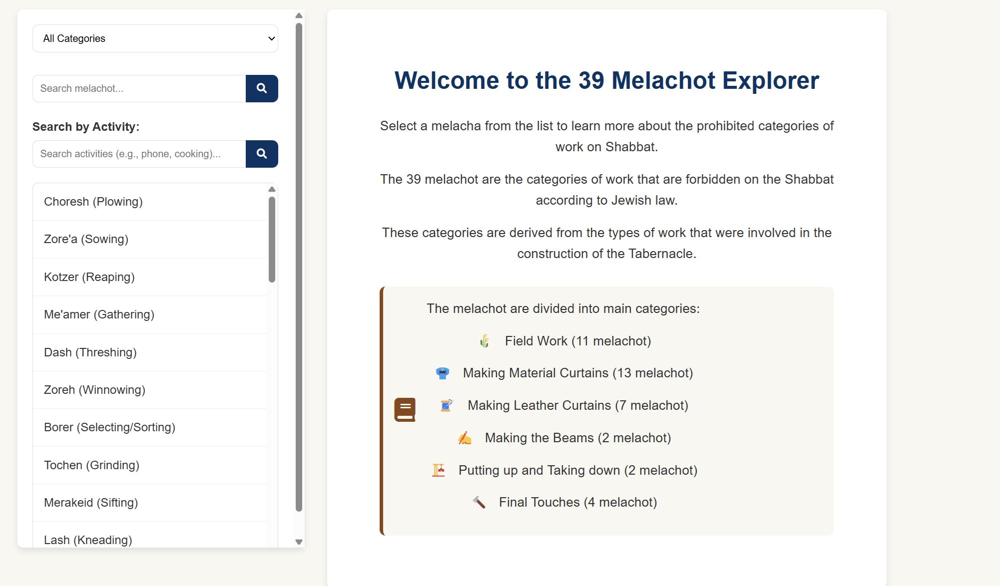
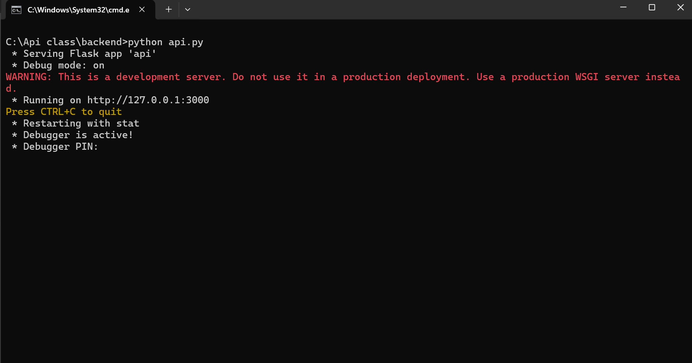
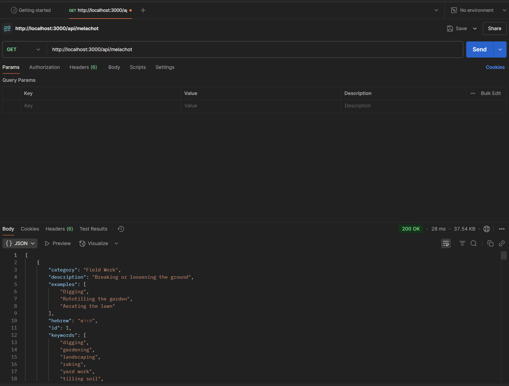

# The Melachot of Shabbat API Project

## Project Overview

This project demonstrates a full-stack web application that provides information about the 39 Melachot (categories of work prohibited on the Jewish Sabbath). The project consists of:

1. A Flask-based RESTful API backend (`backend/api.py`)
2. A static HTML frontend (`frontend/index.html`)
3. Separated CSS styles (`frontend/styles/styles.css`)
4. Client-side JavaScript (`frontend/js/script.js`)

The application allows users to browse, search, and filter the 39 Melachot by category, name, description, and related modern activities.



## Getting Started

### Prerequisites

- Python 3.6 or higher
- Web browser (Chrome, Firefox, Edge, etc.)
- Basic understanding of web applications and APIs

### Installation Steps

1. **Download the project files**:
   - Those are our files:
     - `api.py` - The Flask API backend
     - `index.html` - The main HTML file
     - `styles.css` - CSS styles
     - `script.js` - Client-side JavaScript
     - `requirements.txt` - Python dependencies

2. **Install Python dependencies**:
   ```bash
   pip install -r requirements.txt
   ```
   
   This will install Flask and Flask-CORS, which are required for the API to run.

3. **Start the backend server**:
   ```bash
   python api.py
   ```
   
   You should see output indicating that the Flask development server is running on http://127.0.0.1:3000/

   

4. **Open the frontend**:
   - Go to `frontend` on your folder
   - Open `index.html` in your web browser
   - You can do this by double-clicking the file or right-clicking and selecting "Open with" your preferred browser

5. **Verify the connection**:
   - The web page should load and display the 39 Melachot
   - The sidebar should populate with categories and the melachot list
   - You should be able to click on items to see details


## Project Structure

### Backend API (`api.py`)

The API is built with Flask and provides endpoints to access data about the 39 Melachot. It includes:

- **Data model**: A list of dictionaries containing information about each melacha
- **RESTful endpoints**: Routes for retrieving, adding, updating, and deleting melachot
- **Search functionality**: Endpoints for searching by name, description, and keywords
- **Category filtering**: Endpoints for filtering by category

### Frontend (`index.html`, `styles.css`, `script.js`)

The frontend is a responsive single-page application that:

- Fetches data from the API
- Displays a list of all melachot
- Provides filtering by category
- Offers search functionality for both general terms and activity-specific keywords
- Shows detailed information about each melacha when selected

## API Documentation

### Available Endpoints

| Method | Endpoint | Description |
|--------|----------|-------------|
| GET | `/api/melachot` | Get all melachot |
| GET | `/api/melachot/<id>` | Get a specific melacha by ID |
| GET | `/api/categories` | Get list of all categories |
| GET | `/api/categories/<category>` | Get melachot by category |
| GET | `/api/search?q=<query>` | Search melachot by name/description |
| GET | `/api/search/keywords?keyword=<keyword>` | Search melachot by keywords |
| GET | `/api/keywords` | Get all available keywords |
| POST | `/api/melachot` | Add a new melacha (For debugging purposes) |
| PUT | `/api/melachot/<id>` | Update a melacha |
| DELETE | `/api/melachot/<id>` | Delete a melacha (for debugging purposes)|

### Example API Requests

#### Get all melachot
```
GET http://localhost:3000/api/melachot
```

#### Search by keyword
```
GET http://localhost:3000/api/search/keywords?keyword=cooking
```

#### Add a new melacha (requires JSON body)
```
POST http://localhost:3000/api/melachot
Content-Type: application/json

{
    "name": "Example Melacha",
    "hebrew": "דוגמה",
    "category": "Example Category",
    "description": "An example description",
    "examples": ["Example 1", "Example 2"],
    "keywords": ["keyword1", "keyword2"]
}
```
# Play with it yourself
See if you can do something new!
(Let's remember a melacha shouldn't be added, or deleted unless needed, but you can do it yourself to play with the API, since it's local it won't affect anyone)




## Security and Design Considerations

### Security Issues

1. **No Authentication/Authorization**: 
   - Anyone can access all endpoints, including POST, PUT, and DELETE
   - No API keys or user authentication
   - No protection against unauthorized modifications to data

2. **CORS is Wide Open**: 
   - The API allows requests from any origin with `CORS(app)` 
   - No restrictions on who can make cross-origin requests

3. **No Input Validation**: 
   - Limited validation on input data when creating/updating melachot
   - No sanitization of user input, potentially allowing injection attacks

4. **Debug Mode Enabled**: 
   - The Flask server runs with `debug=True` which exposes error details
   - Should be disabled in production environments

5. **No Rate Limiting**: 
   - No protection against excessive API requests that could overload the server

6. **In-Memory Data Storage**: 
   - All data is stored in memory and lost when the server restarts
   - No persistence or backup mechanism

### Design Limitations

1. **Data Persistence**: 
   - Data lives only in memory and is lost when the server restarts
   - No database integration for persistent storage

2. **Error Handling**: 
   - Limited error handling and reporting
   - Client may receive unclear error messages

3. **Scalability Issues**: 
   - Single-threaded development server not suitable for production loads
   - No caching mechanisms implemented

4. **No API Versioning**: 
   - No versioning strategy for API changes
   - Changes could break existing clients

5. **Limited Documentation**: 
   - No built-in API documentation (Swagger/OpenAPI)
   - Client developers must read code to understand API

6. **Client-Side Fallback**: 
   - While there's a client-side fallback (`allMelachot = localMelachotData`), the variable `localMelachotData` is not defined in the script

## Best Practices for Improvement

### Security Enhancements

1. **Implement Authentication**:
We want to make sure not everyone can use this API if it's for an application.
   ```python
   # Example using Flask-JWT
   from flask_jwt_extended import JWTManager, jwt_required
   
   app.config['JWT_SECRET_KEY'] = 'your-secret-key'  # Change to secure key
   jwt = JWTManager(app)
   
   @app.route('/api/melachot', methods=['POST'])
   @jwt_required()
   def add_melacha():
       # Only authenticated users can add melachot
   ```

2. **Restrict CORS**:
A lot of bots can be used, and abuse the request, CORS can be useful to both restrict the origin of the request and/or the kind of device that can request it from.
   ```python
   # Only allow specific origins
   cors = CORS(app, resources={r"/api/*": {"origins": "https://yourdomain.com"}})
   ```

3. **Add Input Validation**:
Without validation we could have problems when adding a melacha.
   ```python
   def validate_melacha(data):
       required = ['name', 'category', 'description']
       if not all(key in data for key in required):
           return False
       return True
   ```

4. **Implement Rate Limiting**:
Again, bots can abuse the rate limit.
   ```python
   # Using Flask-Limiter
   from flask_limiter import Limiter
   limiter = Limiter(app, key_func=get_remote_address)
   
   @app.route('/api/melachot')
   @limiter.limit("100 per minute")
   def get_all_melachot():
       # Rate-limited endpoint
   ```

### Architecture Improvements

1. **Add Database Persistence**:
   - Implement SQLAlchemy or another ORM
   - Store data in a proper database (SQLite, PostgreSQL, etc.)

2. **API Versioning**:
   - Add version prefixes to routes (`/api/v1/melachot`)

3. **Documentation**:
   - Implement Swagger/OpenAPI documentation
   - Add detailed comments and response examples

4. **Environment Configuration**:
   - Use environment variables for configuration
   - Separate development and production settings

5. **Logging**:
   - Implement proper logging for errors and usage tracking

## Using This for Learning

This project serves as an excellent example for teaching:

1. **API Design**: RESTful principles, endpoint structure
2. **Frontend-Backend Integration**: How a client communicates with a server
3. **Security Issues**: Common vulnerabilities in web applications
4. **Full-Stack Development**: How all pieces work together
5. **Browser Developer Tools**: For inspecting network requests and debugging

### Exercise Suggestions

1. **Add Authentication**: Implement JWT authentication for the API
2. **Add a Database**: Refactor to use SQLite or another database
3. **Fix Security Issues**: Address the security concerns listed above
4. **Extend Functionality**: Add new features like user favorites or comments
5. **Performance Testing**: Load test the API to identify bottlenecks


## Conclusion

This project demonstrates a basic but functional API-driven web application. While it has several security and design limitations, it provides an excellent starting point for learning about API development, security considerations, and full-stack web applications.

By addressing the security issues and implementing the suggested improvements, this project could be transformed into a production-ready application. The clear separation of concerns (backend API, frontend display) makes it a good model for modern web development practices.

---

*Note: This is not supposed to be used as a real guide to learn melachot, just to learn basic API usage*